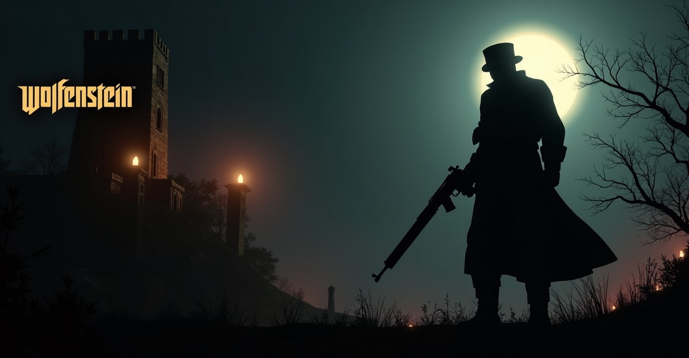

# Wolfenstein 3D — 2026 Browser Remake

> Castle Wolfenstein reimagined with AI. 3 episodes, 15 levels, 3 boss fights — playable in your browser.

**[Play Now](https://theuws.com/games/wolfenstein-3d/)** | **[Credits](#credits)**



## About

A faithful browser-based remake of the classic 1992 FPS **Wolfenstein 3D** by id Software, rebuilt from scratch using modern web technologies and AI-generated assets. Built in approximately **6 hours** across 2 sessions.

This project demonstrates what's possible when a human creative director and an AI game master collaborate at full speed.

## Play

- **URL**: [theuws.com/games/wolfenstein-3d/](https://theuws.com/games/wolfenstein-3d/)
- **Platform**: Any modern browser (Chrome, Firefox, Safari, Edge)
- **Controls**: WASD + Mouse (desktop) / Touch joystick (mobile)
- **Cost**: Free

## Features

### Episodes
| # | Episode | Levels | Boss |
|---|---------|--------|------|
| 1 | Escape from Castle Wolfenstein | 5 | Hans Grösse (850 HP) |
| 2 | Operation Eisenfaust | 5 | Dr. Schabbs (950 HP, summons mutants) |
| 3 | Die, Führer, Die! | 5 | Hitler (2-phase: mech suit 800 HP → human 500 HP) |
| 4-6 | Coming Soon | — | Otto Giftmacher, Gretel Grösse, General Fettgesicht |

### Gameplay
- 5 enemy types: Guard, SS Soldier, Officer, Dog, Mutant
- 4 weapons: Knife, Luger P08, MP40, Chain Gun
- Classic cheat codes: GOD, GUNS, KEYS, MAP, FPS
- Secret walls, locked doors, treasure scoring
- Save/Continue system
- Minimap with fog of war
- CRT retro filter (optional)
- Mobile touch controls

### Technical
- **Engine**: Three.js r170 (WebGL)
- **Code**: 33 ES6 modules, 13,200+ lines — no build step
- **3D Models**: 7 animated enemy models with skeletal walk/attack/death cycles
- **Audio**: Positional audio, dynamic music crossfading (explore → combat)
- **Rendering**: EffectComposer with CRT shader, screen shake, muzzle flash, hit stop

## AI-Generated Assets

Every non-code asset was generated by AI:

| Tool | Assets | Cost |
|------|--------|------|
| [Flux](https://fal.ai) (fal.ai) | 55+ textures, sprites, UI images | ~$2 |
| [Meshy v6](https://fal.ai) (fal.ai) | 8 3D enemy/boss models | ~$4 |
| [Blender 5.1](https://blender.org) | Auto-rigging + skeletal animations | Free |
| [ElevenLabs](https://elevenlabs.io) | 15+ German voice lines, 16+ SFX | $22/mo |
| [Suno](https://suno.com) | 11 original music tracks | $10/mo |
| **Total** | **100+ assets** | **~$6 generation + $32/mo subscriptions** |

## Tech Stack

```
Three.js r170          WebGL 3D engine
ES6 Modules            No bundler, no build step
Web Audio API           Positional audio, crossfading, bus architecture
Pointer Lock API        FPS mouse controls
Canvas API              Minimap rendering
localStorage            Settings + save system
```

## Project Structure

```
wolfenstein-3d/
├── index.html              # Entry point
├── js/
│   ├── engine/             # Renderer, collision, input, level-loader, model-loader
│   ├── game/               # Player, enemies, weapons, doors, pickups, bosses, AI
│   ├── audio/              # Web Audio API manager
│   ├── ui/                 # HUD, menus, minimap, credits, cinematics, settings
│   └── data/               # Episode intros
├── assets/
│   ├── textures/           # Wall/floor/ceiling textures (per episode)
│   ├── models/             # GLB enemy models (animated + static)
│   ├── audio/              # Music, SFX, voice lines
│   ├── sprites/            # Pickup + weapon sprites
│   ├── levels/             # JSON level data (32x32 grids)
│   └── ui/                 # Faces, screens, credits images
├── css/wolf3d.css          # Full game styling
├── MASTERPLAN.md           # Original 537KB planning document
└── AUDIT-REPORT.md         # Technical audit
```

## Development

No build step required. Just serve the files:

```bash
# Local development
python3 -m http.server 8080
open http://localhost:8080/wolf3d.html

# Deploy to production
bash deploy-ftp.sh wolfenstein-3d
```

### Adding a Level

Levels are JSON files in `assets/levels/`. Format:
```json
{
  "name": "Level Name",
  "episode": 1,
  "floor": 1,
  "width": 32,
  "height": 32,
  "walls": [[1,1,1,...], ...],
  "doors": [{"x": 5, "z": 3, "axis": "z", "type": "normal"}],
  "entities": [{"type": "guard", "x": 8.5, "z": 4.5, "angle": 180}],
  "items": [{"type": "health_small", "x": 3.5, "z": 2.5}],
  "secrets": [{"x": 6, "z": 8, "pushDirection": "east"}],
  "exit": {"x": 28, "z": 15},
  "par_time": 90
}
```

Wall types: 0=empty, 1=grey stone, 2=eagle banner, 3=blue brick, 4=prison bars, 5=wood, 6=wood+portrait, 7=metal, 8=door frame, 9=elevator.

## Credits

**Creative Director**: [Richard Theuws](https://theuws.com) — Founder of Theuws Consulting, 25+ years entrepreneur, Bladel, Netherlands

**AI Game Master**: [Claude Opus 4.6](https://claude.ai) by Anthropic — Project manager, technical architect, creative director. 7 specialized sub-agents for analysis, asset generation, audio, 3D animation, narrative, deployment, and process improvement.

**Special Thanks**: id Software (original Wolfenstein 3D, 1992), Bobby Prince (original soundtrack), the Metal Business Club community.

## Contributing

This is an open project. Feel free to:
- Add new levels (Episode 4-6 are waiting!)
- Create new enemy types
- Improve animations
- Fix bugs
- Add features

Fork, modify, submit a PR. All contributions welcome.

## License

This is a fan remake for educational and entertainment purposes. Wolfenstein 3D is a trademark of id Software/ZeniMax Media. This project is not affiliated with or endorsed by id Software.

The source code of this remake is available under the [MIT License](LICENSE).

---

*"Mein Leben!" — Built in Bladel 🇳🇱*
